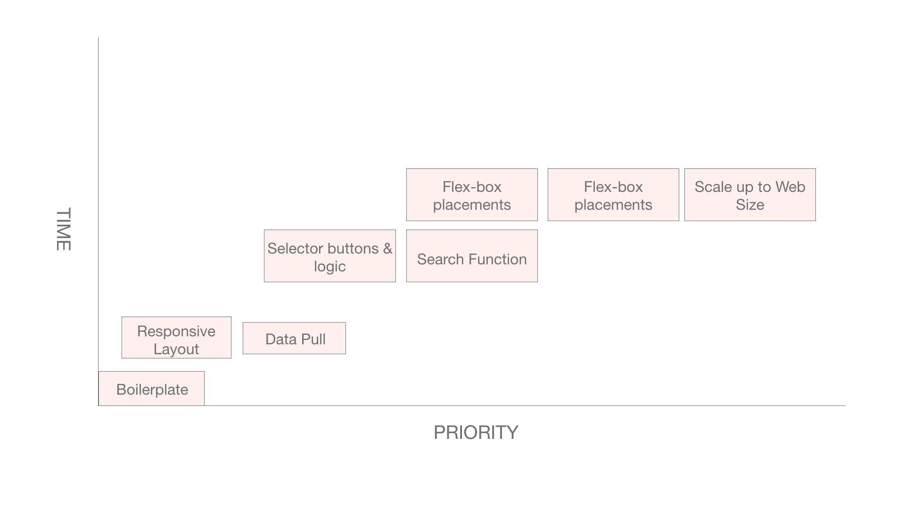

# Project Overview

## Project Name

OSRS-Equipment-viewer

## Project Description

Take input from the OSRSBOX API (contains all the games data needed) and injects it onto an interface where the user can select an item for each “Equip able piece” for a character. Each piece of equipment will have an array of stats, which will be pushed to a summed total of each stat to show on the side for totaled stats.

## API and Data Sample

https://github.com/osrsbox/osrsbox-api

```
    "_items": [
        {
            "_id": "610b62e66d4abbe9cf68804f",
            "id": "35",
            "name": "Excalibur",
            "last_updated": "2021-08-05",
            "incomplete": false,
            "members": true,
            "tradeable": false,
            "tradeable_on_ge": false,
            "stackable": false,
            "stacked": null,
            "noted": false,
            "noteable": false,
            "linked_id_item": null,
            "linked_id_noted": null,
            "linked_id_placeholder": 16525,
            "placeholder": false,
            "equipable": true,
            "equipable_by_player": true,
            "equipable_weapon": true,
            "cost": 200,
            "lowalch": 80,
            "highalch": 120,
            "weight": 2.267,
            "buy_limit": null,
            "quest_item": true,
            "release_date": "2002-02-27",
            "duplicate": false,
            "examine": "This used to belong to King Arthur.",
            "icon": "iVBORw0KGgoAAAANSUhEUgAAACQAAAAgCAYAAAB6kdqOAAABlElEQVR4XuWV/UoCQRTFvW/iI/QCgiEhYX8kSGKSRJJImmRmZppsREb0oYlfKRFR73ni3m3WacH+c2ahA5eFYZb9cc6Z2VDof4jgX7EowufrFAGBInxMJngbDgVoLRy2CUWYvfQFSMFYBCJM+z18zWfBcYdB3sdjGctAi6gCAORGxRAKyHJ/3KgYRo11d3QY60DzwSAoQITx89PSuKwAcVzskP9kWYBhLQfy7zQgwujxQSLj+0e/mQ0C8Z9b/b1dIHaIgdglw+4Q2vU6Oo3GD5RbaAVkxZ2z4zLurx35uIqLgdSaQRgW4c7peO4oIJ5FlHqkKxfhKJ/H+UnFA+JRkLdXbYmUXTQERdiKx7GTTOIgm0WlWPQcuWm1cFmrCbDqmKH4SPrCrrAjmVRKYE5LJezvZuSpYAwAuU44zaa40Ot2xbHtREKGXTMIwyKJ5aJa1Xrye4zCMARHUi4UxCUdQB//mysQCQQX9jCXk64YdsMvkn7spdNywvTi+ncaEmE9EsFGNIrNWMy2O0pWivu3DBc3ePoGJEi3eoT8/88AAAAASUVORK5CYII=",
            "wiki_name": "Excalibur",
            "wiki_url": "https://oldschool.runescape.wiki/w/Excalibur",
            "equipment": {
                "attack_stab": 20,
                "attack_slash": 29,
                "attack_crush": -2,
                "attack_magic": 0,
                "attack_ranged": 0,
                "defence_stab": 0,
                "defence_slash": 3,
                "defence_crush": 2,
                "defence_magic": 1,
                "defence_ranged": 0,
                "melee_strength": 25,
                "ranged_strength": 0,
                "magic_damage": 0,
                "prayer": 0,
                "slot": "weapon",
                "requirements": {
                    "attack": 20
                }
            }
```

## Wireframes

https://xd.adobe.com/view/7c37346a-9513-4da9-9c52-3e834def3216-2964/

### MVP/PostMVP

#### MVP

• Put images on correct spot using flex-box

• Display a sum of stats on the side

• Select menu for each slot

• Make sure correct images match the given item

• Make function to select ONLY relevant information due to complexity of the objects

#### PostMVP

• Make a preset saver (show JSON object to copy and share with others)

• Access the OSRS official API to get user data to use

• Take user data and apply conditionals that say whether you can or cannot use the gear present.

• Add math functions to calculate damage with equipment

• Add in prayer bonuses to stats

## Project Schedule

This schedule will be used to keep track of your progress throughout the week and align with our expectations.

You are **responsible** for scheduling time with your squad to seek approval for each deliverable by the end of the corresponding day, excluding `Saturday` and `Sunday`.

| Day         | Deliverable                                        | Status   |
| ----------- | -------------------------------------------------- | -------- |
| August 29   | Prompt / Wireframes / Priority Matrix / Timeframes | complete |
| August 30   | Project Approval                                   | complete |
| August 31   | Core Application Structure (HTML & CSS)            | complete |
| September 1 | Pseudocoded, JS basic logic                        | complete |
| September 2 | JS buttons, search filter, dynamic inputs          | complete |
| September 3 | MVP                                                | complete |
| September 3 | Presentations                                      | complete |

## Priority Matrix

| Component                          | Priority |
| ---------------------------------- | :------: |
| Boilerplate                        |   1st    |
| Responsive layout                  |   2nd    |
| Data pull for Selectors            |   3rd    |
| create Selectors & logic           |   4th    |
| search function                    |   5th    |
| flex-box placements                |   6th    |
| dynamic img placements on flex-box |   7th    |
| scale up to web size               |   8th    |



## Timeframes

| Component                  | Priority | Estimated Time | Time Invested | Actual Time |
| -------------------------- | :------: | :------------: | :-----------: | :---------: |
| HTML boilerplate           |    H     |     1 hrs      |    0.5 hrs    |   0.5 hrs   |
| make basic css layout      |    H     |     2 hrs      |     2 hrs     |   2.5 hrs   |
| pseudo code logic JS       |    H     |     2 hrs      |     2 hrs     |   4.5 hrs   |
| fetch data                 |    H     |     1 hrs      |    0.5 hrs    |    5 hrs    |
| create selectors for items |    H     |     3 hrs      |     6 hrs     |   11 hrs    |
| attach logic to buttons    |    H     |     3 hrs      |     3 hrs     |   14 hrs    |
| creating dynamic search    |    H     |     4 hrs      |     8 hrs     |   22 hrs    |
| flex-box icon placements   |    H     |     4 hrs      |     5 hrs     |   27 hrs    |
| stat calc & placement      |    H     |     3 hrs      |     2 hrs     |   29 hrs    |
| create dynamic JS imgs     |    H     |     3 hrs      |     2 hrs     |   31 hrs    |
| scale up to web size       |    H     |     4 hrs      |     2 hrs     |   33 hrs    |
| Total                      |    H     |     30 hrs     |    33 hrs     |   33 hrs    |

## Code Snippet

```
headButton.addEventListener("click", () => {
  let filteredItems = headArr
  searchInput.style.display = "block";
  searchList.style.display = "block";
  searchInput.addEventListener("keyup", (e) => {
    console.log(e.target.value)
    searchList.innerHTML = "";
    filteredItems = headArr.filter(item => {
      let splitItem = item.name.split(" ")
      if (splitItem.includes(e.target.value)) {
        return item
      }
    })
    console.log(filteredItems)
    filteredItems.forEach(item => {
      let itemName = document.createElement('h5');
      console.log(itemName)
      itemName.innerText = item.name;
      itemName.addEventListener("click", () => {
        allitemsArr.push(item)
        filteredItems = headArr;
        searchInput.value = "";
        searchList.innerHTML = "";
        searchInput.style.display = "none";
        searchList.style.display = "none";
        getIcons(item.id, headItemDiv)
      })
      searchList.append(itemName);
    })
  })

})
```

## Change Log

Made a hidden search connected to each icon button for lists of items so it kept the screen cleaner than having a cluster of searchable items being inline and distorting the sizes of the containers.
